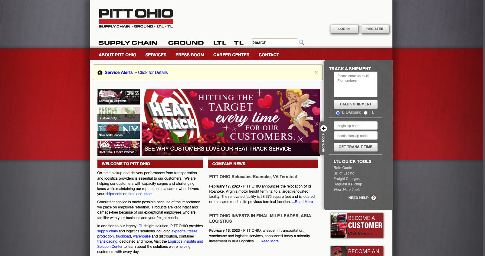
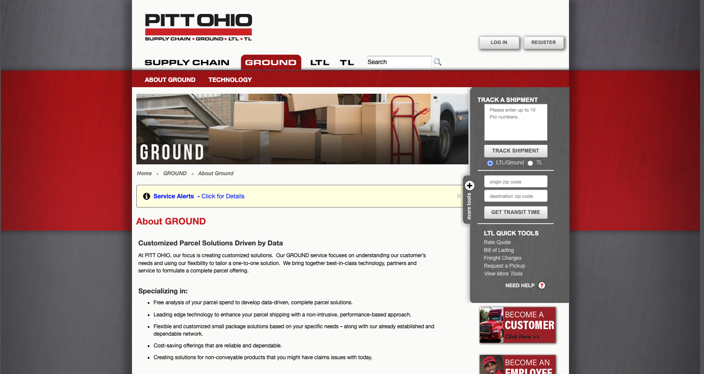
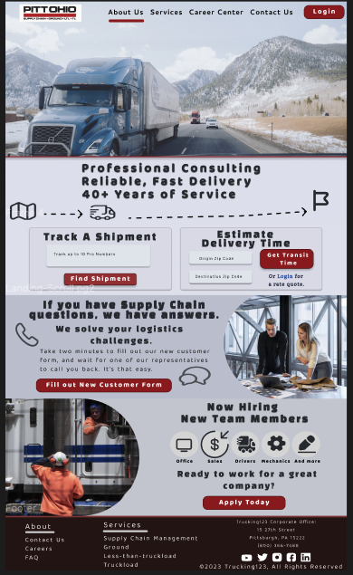

# Refine a Trucking Company's website
In this project, I took a trucking company's website and gave it some updates to reflect modern UI/UX design. 

## Technologies:

* Figma- Design Layout
* React - Javascript Library for building User Interfaces

# Original Site:
Taking the original design and rethinking the website's layout and content strategy. 

# Figma Landing Page Design
Using some of the page's original color schemes, I created a modernized layout and less verbose descriptions. 

